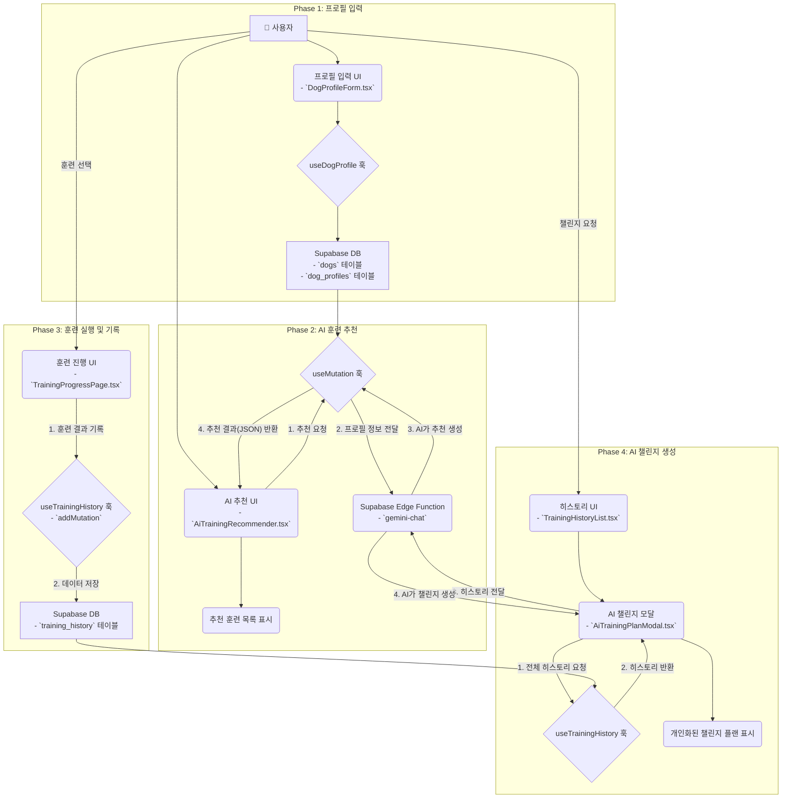

# AI 훈련 추천 기능: 기술 스택 및 데이터 흐름도

이 문서는 AI 훈련 추천 기능의 전체적인 데이터 흐름과 각 단계별 기술 스택을 설명합니다.

---

## 1. 🗺️ 전체 데이터 흐름도 (Data Flow Diagram)

---

## 2. 🛠️ 단계별 기술 상세 분석

### **Phase 1: 강아지 정보 입력 (데이터의 시작)**

1.  **사용자 인터페이스 (`DogProfileForm.tsx`):**
    -   사용자는 이 컴포넌트를 통해 강아지의 이름, 품종, 나이, 건강 상태, 훈련 목표 등 핵심 정보를 입력합니다.
    -   `shadcn/ui`와 `Tailwind CSS`를 사용하여 직관적이고 사용하기 쉬운 폼을 제공합니다.

2.  **상태 관리 및 API 호출 (`useDogProfile.ts`):**
    -   입력된 정보는 `Zustand` 또는 `useState`를 통해 관리됩니다.
    -   프로필 저장 시, `useDogProfile` 훅 내부의 `useMutation`이 호출되어 Supabase API를 통해 데이터를 전송합니다.

3.  **데이터베이스 (Supabase DB):**
    -   전송된 데이터는 `dogs` 테이블(기본 정보)과 `dog_profiles` 테이블(추가 정보)에 나뉘어 저장됩니다. 이 데이터는 이후 모든 AI 기능의 기반이 됩니다.

### **Phase 2: AI 훈련 추천 (개인화의 핵심)**

1.  **사용자 인터페이스 (`AiTrainingRecommender.tsx`):**
    -   사용자가 'AI 추천 받기' 버튼을 클릭하면, 추천 생성 프로세스가 시작됩니다.
    -   `useDogProfile` 훅을 통해 현재 강아지의 프로필 정보를 가져옵니다.

2.  **API 호출 (`useMutation`):**
    -   `recommendTrainingMutation`이 실행됩니다.
    -   **프롬프트 엔지니어링:** 저장된 강아지 프로필과 사용자가 설정한 '훈련 목표'를 조합하여, Gemini AI가 가장 잘 이해할 수 있는 형태의 상세한 프롬프트를 동적으로 생성합니다.
    -   **API 요청:** 생성된 프롬프트를 담아 `supabase.functions.invoke('gemini-chat', ...)`를 통해 Supabase Edge Function을 호출합니다.

3.  **AI 모델 (Supabase Edge Function - `gemini-chat`):**
    -   Edge Function은 전달받은 프롬프트를 Google Gemini API로 보냅니다.
    -   AI는 프롬프트의 지시에 따라, 강아지에게 맞는 훈련 2가지를 추천하고, 지정된 JSON 형식에 맞춰 결과를 생성합니다.

4.  **결과 처리:**
    -   `AiTrainingRecommender`는 AI로부터 받은 JSON 응답을 파싱하고, 데이터 구조를 검증한 후 화면에 추천 훈련 목록을 렌더링합니다.
    -   `useSaveAiRecommendations` 훅을 통해 생성된 추천 결과를 DB에 저장하여, 사용자가 나중에 다시 볼 수 있도록 합니다.

### **Phase 3: 훈련 실행 및 히스토리 기록 (데이터 축적)**

1.  **사용자 인터페이스 (`TrainingProgressPage.tsx`):**
    -   사용자가 추천받은 훈련 중 하나를 선택하면, 이 페이지로 이동하여 단계별 훈련을 진행합니다.

2.  **API 호출 (`useTrainingHistory.ts`):**
    -   훈련이 완료되면, `onFinish` 콜백이 실행되고 `useTrainingHistory` 훅의 `addMutation`이 호출됩니다.
    -   훈련 종류, 소요 시간, 성공률 등의 결과 데이터가 Supabase API를 통해 전송됩니다.

3.  **데이터베이스 (Supabase DB):**
    -   훈련 결과는 `training_history` 테이블에 차곡차곡 저장됩니다. 이 누적된 데이터는 Phase 4의 핵심 자산이 됩니다.

### **Phase 4: AI 훈련 챌린지 생성 (데이터의 활용)**

1.  **사용자 인터페이스 (`TrainingHistoryList.tsx` -> `AiTrainingPlanModal.tsx`):**
    -   사용자가 히스토리 페이지에서 'AI 훈련 챌린지 시작하기' 버튼을 클릭하면, `AiTrainingPlanModal`이 열립니다.

2.  **데이터 조회 및 API 호출:**
    -   모달은 `useTrainingHistory` 훅을 통해 `training_history` 테이블의 모든 기록을 가져옵니다.
    -   가져온 전체 훈련 기록을 JSON 데이터로 만들어, Phase 2와 동일한 `gemini-chat` Edge Function을 다시 호출합니다. 단, 이번에는 **"이 기록을 분석해서 장기적인 훈련 계획을 짜줘"** 라는 새로운 프롬프트를 사용합니다.

3.  **AI 모델 및 결과 처리:**
    -   AI는 누적된 훈련 기록의 패턴(예: 정체된 훈련, 성공률 추이)을 분석하여, '핵심 성장 목표'와 '14일 챌린지 계획'을 담은 새로운 JSON을 생성합니다.
    -   모달은 이 결과를 받아 사용자에게 개인화된 장기 훈련 계획을 제시합니다.
